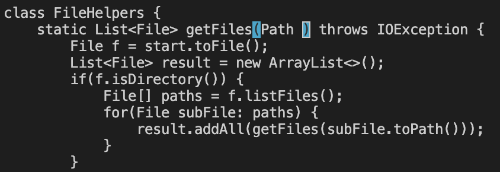
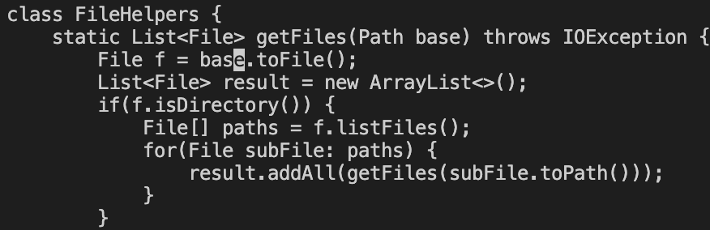
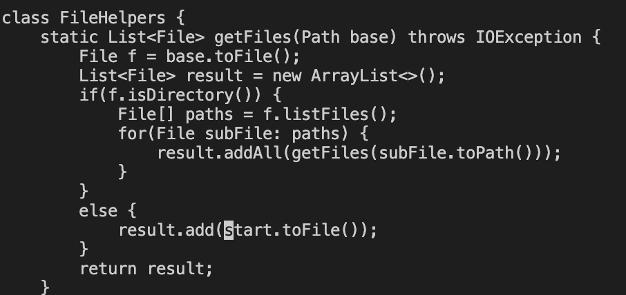
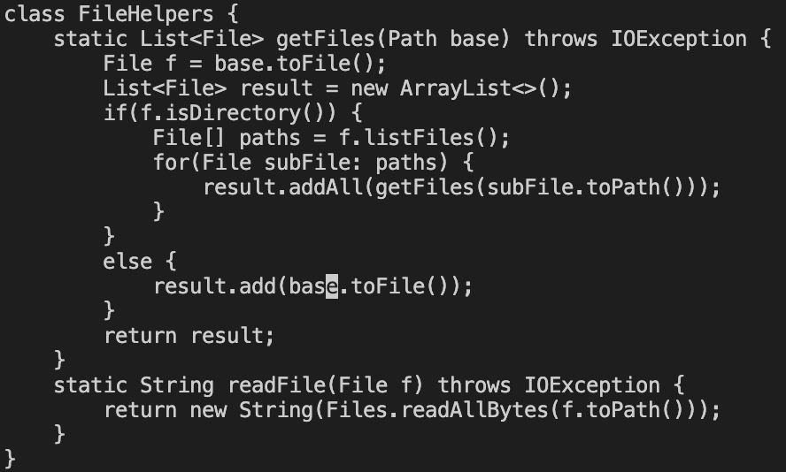

# Part 1

#### The task that I chose was: Changing the **start** parameter to **base**

The commands that my group came up with were:

``/start <enter>``

This step uses /value to search for a sequence of characters in the file.
Then it sends you to the first character of the first found sequence

``c``
``e``

**ce** deletes the current word, then allows us to edit

``base``

Then we replace the deleted word with **base**

``<Esc>``
``n``

Then **escape** sends us back into normal mode
We can then use **n** to find the next instance of the sequence that we are searching for

``.``

**.** stores the commands we used to edit the previous instance of start
When we use **.** it performs those commands in the same order

``n``

We then search for the last instance

``.``

We repeat the commands with **.**

``:wq``

Then we save and quit.

