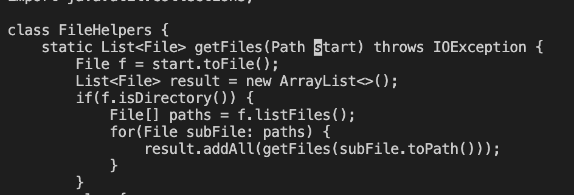
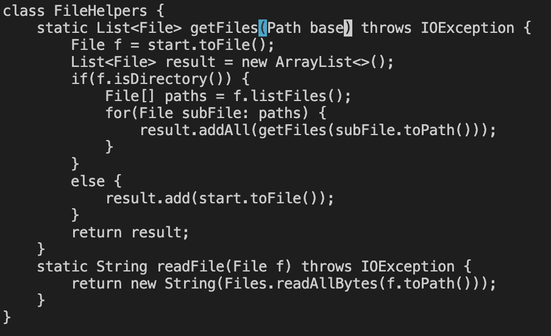
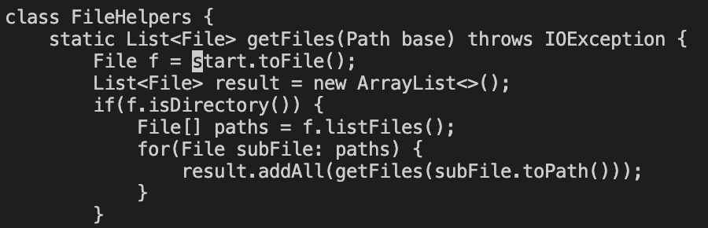

# LAB 4

## Part 1

#### The task that I chose was: Changing the **start** parameter to **base**

The commands that my group came up with were:

``/start <enter>``

This step uses /value to search for a sequence of characters in the file.
Then it sends you to the first character of the first found sequence

``c``
``e``

**ce** deletes the current word, then allows us to edit

``base``

Then we replace the deleted word with **base**

``<Esc>``
``n``

Then **escape** sends us back into normal mode
We can then use **n** to find the next instance of the sequence that we are searching for

``.``

**.** stores the commands we used to edit the previous instance of start
When we use **.** it performs those commands in the same order

``n``

We then search for the last instance

``.``

We repeat the commands with **.**

``:wq``

Then we save and quit.

## Part 2

- For the first attempt, it took me 120s to edit in Vs Code, 
scp the file to the server, ssh, and test.  It takes a long time to scp, 
then ssh, then cd into the right file.

- For the second attempt, it took me 30s to vim, edit, and run

#### Which of these two styles would you prefer using if you had to work on a program that you were running remotely, and why?

I prefer using vim becuase it takes a lot less steps. It also takes a bit of time to use scp and ssh.
I also like the quick editing tools that vim has.  Although at first, they are a bit unintuitve.

#### What about the project or task might factor into your decision one way or another? (If nothing would affect your decision, say so and why!)

I would say that if I was doing a project or a task for which I was running something on a remote server,
I would definetly use vim often for minor changes. Although, I would be more inclined to use VS code for the bulk of project because I like having my minor syntax mistakes being caught by the VS code editor.

