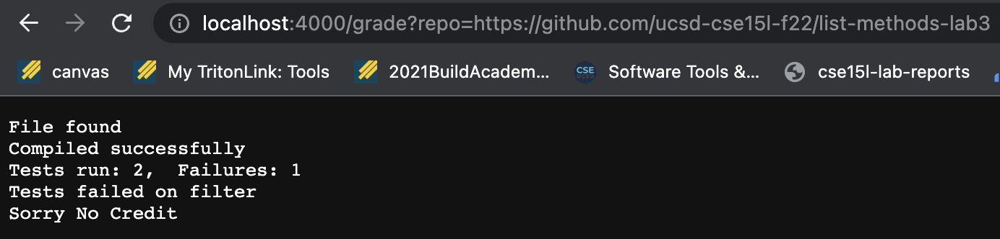
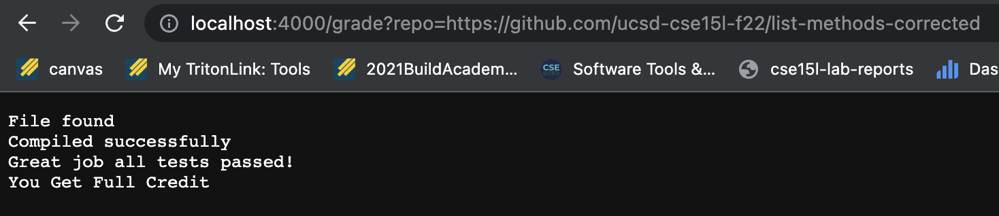
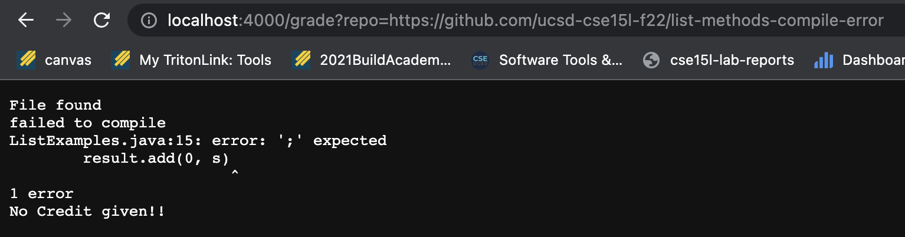

# LAB 5

## Grade.sh

```
rm -rf student-submission
git clone $1 student-submission 2> null


cp TestListExamples.java student-submission

cp -r ./lib student-submission


cd student-submission

if [[ -f "./ListExamples.java" ]]

    then
        echo "File found"

    else 
        echo "File not found"
        echo "No Credit Given"
        exit 1

fi

javac -cp .:lib/hamcrest-core-1.3.jar:lib/junit-4.13.2.jar *.java 2> error.txt


if [[ $? -eq 0 ]]
    then 
        echo "Compiled successfully"
    else
     echo "failed to compile"
     cat error.txt
     echo "No Credit given!!"
     exit 1
fi

java -cp .:lib/hamcrest-core-1.3.jar:lib/junit-4.13.2.jar org.junit.runner.JUnitCore TestListExamples > results.txt 2> error.txt 

if grep "Failures" results.txt > null
    then 
        grep "Tests run:" results.txt
        if grep "merge" results.txt > null 
            then 
                echo "Tests failed on merge"
                echo "Sorry No Credit"
        fi
        if grep "filter" results.txt > null 
            then 
                echo "Tests failed on filter"
                echo "Sorry No Credit"
        fi
    else
        echo "Great job all tests passed!"
        echo "You Get Full Credit"
        
fi

```

**http://localhost:4000/grade?repo=https://github.com/ucsd-cse15l-f22/list-methods-lab3**



**http://localhost:4000/grade?repo=https://github.com/ucsd-cse15l-f22/list-methods-corrected**



**http://localhost:4000/grade?repo=https://github.com/ucsd-cse15l-f22/list-methods-compile-error**



## Trace

I will be tracing the last screenshot example. 

***line 3: rm -rf student-submission***

For this line there is no standard output or error. The exit code is zero.

***git clone $1 student-submission 2> null***

For this line the standard out is the info give by git clone about what is happening on the remote and what is recieved. The standard error says what directory it is cloning into. This an exit code of zero.

***cp TestListExamples.java student-submission***

This has no ouput, no error, and exit code of zero.

***cp -r ./lib student-submission***

This has no ouput, no error, and exit code of zero.

***cd student-submission***

This has no ouput, no error, and exit code of zero.

***if [[ -f "./ListExamples.java" ]]***

The conditional is true because the file exists.

***echo "File not found"***
***echo "No Credit Given"***
***exit 1***

This line does not run, if branch does not evaluate.

***echo "File found"***

The ouput is "File found", no error and an exit code of zero.

***javac -cp .:lib/hamcrest-core-1.3.jar:lib/junit-4.13.2.jar *.java 2> error.txt***

There is no standard output, the error is what the compiler outputs for the syntax error and it has a non-zero exit code. The error is redirected into a file.

***if [[ $? -eq 0 ]]***

The conditional is false because $? is non-zero

*** echo "Compiled successfully"***

This line does not run, if branch does not evaluate.

***echo "failed to compile"***

The standard output is "failed to compile", no error, and an exit code of 0.

***cat error.txt***

The standard out is the contents of error.txt, no error, and an exit code of zero.

***echo "No Credit given!!"***

The standard out is "No Credit given!!", no error, and an exit code of zero.

***exit 1***

No output, no error, and an exit code of 1.

***java -cp .:lib/hamcrest-core-1.3.jar:lib/junit-4.13.2.jar org.junit.runner.JUnitCore TestListExamples > results.txt 2> error.txt*** 
***if grep "Failures" results.txt > null***
***grep "Tests run:" results.txt***
***if grep "merge" results.txt > null***  
***echo "Tests failed on merge"***
***echo "Sorry No Credit"***
***if grep "filter" results.txt > null***  
***echo "Tests failed on filter"***
***echo "Sorry No Credit"***
***echo "Great job all tests passed!"***
***echo "You Get Full Credit"***
        
Early exit these lines do not evaluate.


